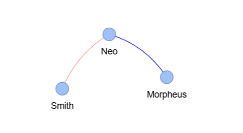

# Story2Graph

Turn a **story** into an **interactive graph**, where characters become **nodes** and their interactions form **edges**.

Visualizing a story as a graph reveals its hidden structure:

* Identify key **characters** and their **influence**.

* Analyze **relationship dynamics**: friendships, conflicts, alliances, etc.

* Apply **graph algorithms** (centrality, communities, shortest paths, etc.) to uncover patterns and connections.

**From exploring complex storylines to unlocking the power of graph analysis, Story2Graph brings a new perspective to
understanding interactions in a narrative.**


<table align="center">
  <tr>
    <th style="text-align:center;"><strong>Input</strong></th>
    <th style="text-align:center;"><strong>Output</strong></th>
  </tr>
  <tr>
    <td style="text-align:center; width:50%;">
      <em>"At his workplace, Neo is pursued by police and Agents led by Agent Smith. Morpheus guides Neo's escape by phone, able to somehow remotely observe their movements, but Neo ultimately surrenders rather than risk a hazardous getaway."</em>
    </td>
    <td style="text-align:center; width:50%;">
      
    </td>
  </tr>
</table>


## Current state :

Story2Graph **detects characters** in a text and determines their **relationships** (allies, enemies, etc.).

## How does it work ?

1. Detect characters (**NER**)
2. Preprocessing (**Coreference Resolution**)
3. **Improving NER** and **CR** with some tricks
4. Get each character associated to each sentence (group of sentences for optimization)
5. **Matrix of interaction** between characters: Each pairs of characters get a value with **Zero-Shot Learning** based
   on their interactions.
6. Matrix converted to **interactive Graph**
7. Graph can be **saved** to HTML format

## How to use it ?

### Clone this repository

```bash
git clone https://github.com/SamyMgi/story2graph.git
```

### Install the dependencies

```bash
pip install -r requirements.txt
```

### Example of usage

```python
# Import the class
from story2graph import Story2Graph

# Example raw story
story = "At his workplace, Neo is pursued by police and Agents led by Agent Smith. Morpheus guides Neo's escape by phone, able to somehow remotely observe their movements, but Neo ultimately surrenders rather than risk a hazardous getaway."

# Instantiate the class with a story (pass the text directly if path=False, or a file path if path=True)
s2g = Story2Graph(story, path=False)

# Generate and save the graph as an interactive HTML file at the specified output path
output_path = "output/graph.html"
s2g.generate_graph(output_path)

# Optionally, display useful information like the resolved coreference text and interaction matrix
print("Coref resolved text:", s2g.get_coref_resolution())
print("Interaction matrix:", s2g.get_interaction_matrix())

```